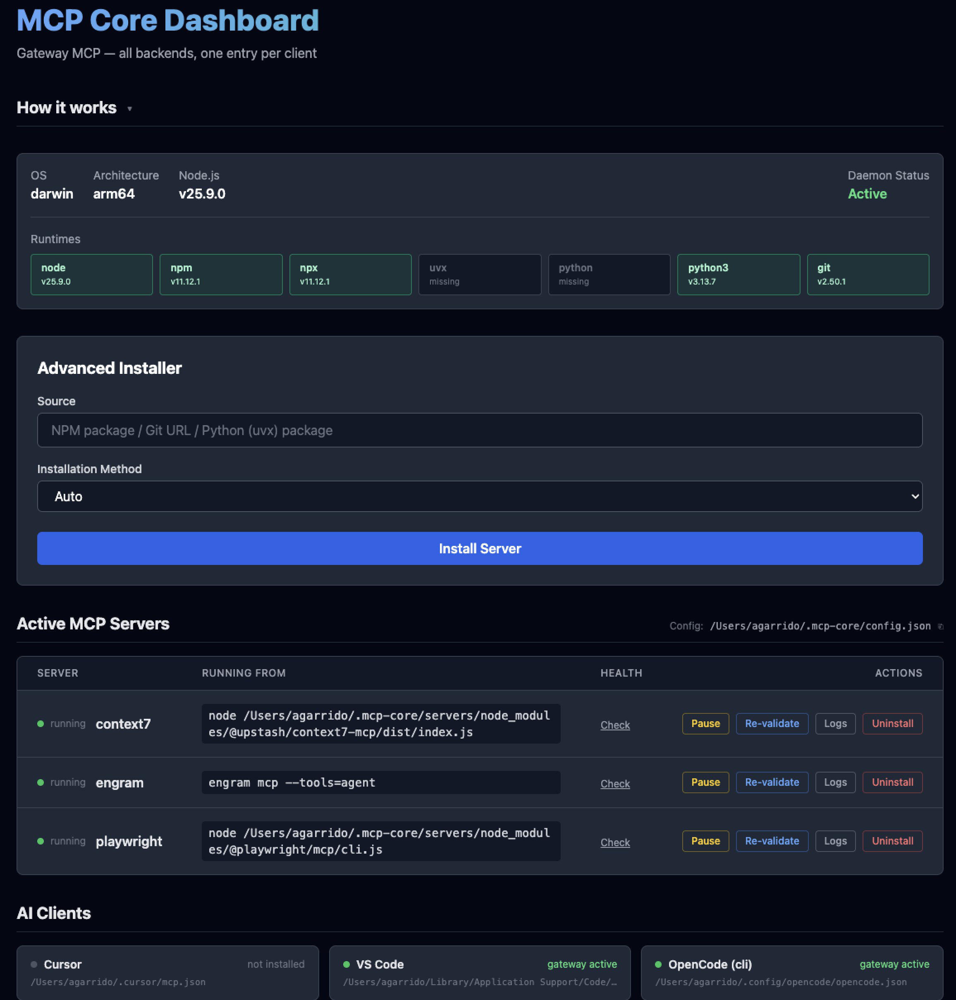

# mcp-core ⚡️
**Gateway MCP — un único punto de entrada para todos tus servidores**



`mcp-core` pone **una sola entrada** en cada cliente de IA (Cursor, Claude Desktop, VS Code…) y desde ahí expone todos los servidores MCP que tengas instalados. En lugar de que cada cliente gestione sus propias conexiones, hay un daemon central que mantiene una instancia por servidor — compartida entre todos los clientes.

El cliente ve herramientas prefijadas por servidor: `context7__get_library_docs`, `playwright__browser_navigate`, `mcp_core__install_server`, etc. Al instalar un servidor nuevo, aparece en todos los clientes automáticamente sin tocar ningún archivo de configuración.

---

## ⚡ Quick Start

```bash
# 1) Instala mcp-core globalmente
#     El binario `mcp-core-mcp` debe estar en el PATH para que los clientes de IA
#     puedan arrancar el gateway cuando lo necesiten.
npm install -g mcp-core

# 2) Bootstrap: inyecta la entrada del gateway en todos los clientes detectados
#     Detecta las entradas legacy, las importa al registro central y reemplaza todo
#     por la única entrada del gateway. Un backup `.backup` se crea antes de sobreescribir.
mcp-core init

# 3) (Opcional) Instala un servidor MCP — disponible en todos los clientes al instante
#     o haz esto desde el paso 5 desde la interfaz UI.
mcp-core install @modelcontextprotocol/server-memory

# 4) (Opcional) Si ya tenías servidores MCP configurados en otros clientes,
#     se migran a ~/.mcp-core/servers/ para que sean independientes de esos clientes.
#     Usa `--dry-run` para ver exactamente qué se haría sin tocar nada.
mcp-core migrate

# 5) (Opcional) Abre el dashboard web para gestionar servidores visualmente.
mcp-core ui
```

El daemon se arranca solo la primera vez que un cliente conecta y queda vivo en segundo plano. No es necesario reiniciar el cliente si éste soporta `tools/list_changed`.

---

## 🏗️ Arquitectura

```
 Cursor           Claude Desktop       VS Code
   │ stdio             │ stdio            │ stdio
   ▼                   ▼                  ▼
mcp-core-mcp       mcp-core-mcp       mcp-core-mcp   ← gateway shim (1 por cliente)
   │                   │                  │
   │         UNIX socket                  │
   ▼                   ▼                  ▼
┌────────────────────────────────────────────────┐
│              mcp-daemon (1 proceso)            │
│  ┌─────────────┐  ┌────────────────┐           │
│  │server-memory│  │server-filesyst.│  …        │
│  └─────────────┘  └────────────────┘           │
└────────────────────────────────────────────────┘
```

- **Gateway shim (`mcp-core-mcp`)**: binario MCP ligero. Se conecta al daemon, suscribe a cambios de backends y reexpone todas las tools/resources/prompts con prefijo (`<backend>__<name>`). Si el daemon no está corriendo, lo arranca automáticamente.
- **Daemon**: supervisa y multiplexa backends MCP. Cuando el gateway conecta, arranca todos los backends configurados para descubrir sus capabilities. Si un backend lleva ~5 minutos sin recibir llamadas, el daemon mata su proceso automáticamente para ahorrar RAM (las capabilities quedan en caché para relanzarlo al instante). Notifica a todos los shims cuando se instala o desinstala un servidor — los clientes que soportan `list_changed` reciben las nuevas tools sin reiniciar.
- **CLI (`mcp-core`)**: instalar, desinstalar, migrar, inicializar y lanzar el dashboard.

### Prefijado de capabilities

| Capability | Prefijo | Ejemplo |
|---|---|---|
| Tools | `<backend>__<name>` | `memory__store`, `mcp_core__list_servers` |
| Resources | URI `mcp-core://<backend>/<uri>` | `mcp-core://filesystem/file:///foo` |
| Prompts | `<backend>__<name>` | `github__create_issue` |

Las 5 tools de control del gateway viven bajo el prefijo `mcp_core__`: `install_server`, `uninstall_server`, `list_servers`, `toggle_client`, `get_daemon_status`.

---

## 💻 Clientes soportados

`mcp-core init` detecta e inyecta la entrada del gateway automáticamente en:

| Cliente | Path (macOS) | Path (Linux) | Clave raíz |
|---|---|---|---|
| **Cursor** | `~/.cursor/mcp.json` | `~/.cursor/mcp.json` | `mcpServers` |
| **VS Code / Copilot** | `~/Library/Application Support/Code/User/mcp.json` | `~/.config/Code/User/mcp.json` | `servers` |
| **Claude Desktop** | `~/Library/Application Support/Claude/claude_desktop_config.json` | — | `mcpServers` |
| **Claude Code** | `~/.claude.json` | `~/.claude.json` | `mcpServers` |
| **OpenCode (cli)** | `~/.config/opencode/opencode.json` | `~/.config/opencode/opencode.json` | `mcp` |

> **Windows**: fuera del alcance actual.

---

## 🛠️ Comandos (CLI)

```bash
# Bootstrap del gateway: inyecta mcp-core en todos los clientes y migra entradas legacy
mcp-core init [--clients cursor,claudeCode]

# Instalar un servidor MCP
mcp-core install <npm-pkg | git-url | uvx-pkg> [opciones]
  --name <alias>              alias del servidor
  --env KEY=value             variable de entorno (repetible)
  --method auto|npm|uvx|git   método de instalación (por defecto: auto)
  --no-validate               saltarse el handshake MCP de verificación

# Desinstalar un servidor
mcp-core uninstall <server-name>

# Migrar servidores legacy al directorio gestionado por mcp-core
mcp-core migrate [--dry-run]

# Estado: daemon, servidores registrados y su estado en vivo, runtimes
mcp-core status

# Comandos del daemon
mcp-core daemon stop
mcp-core daemon restart
mcp-core daemon logs [server-name] [-f] [-n <N>]

# Dashboard web local
mcp-core ui
```

### Instalación de paquetes npm

Para paquetes npm, `mcp-core install` descarga e instala el paquete en `~/.mcp-core/servers/node_modules/` (un `node_modules` compartido entre todos los servidores). El binario se resuelve automáticamente desde el `package.json` del paquete:

```text
✅ Installed server-memory
   Validated: 9 tools (154ms)
```

El comando almacenado apunta al path local: `node ~/.mcp-core/servers/node_modules/@modelcontextprotocol/server-memory/dist/index.js`. No depende de npm ni de red tras la instalación. Al desinstalar, se ejecuta `npm uninstall` para limpiar el `node_modules` compartido.

### Environment variables

```bash
mcp-core install @modelcontextprotocol/server-github \
  --env GITHUB_TOKEN=ghp_xxx
```

### Soporte uvx (Python)

`--method uvx` fuerza el runner; `auto` lo detecta para paquetes con prefijo `mcp-server-`:

```bash
mcp-core install mcp-server-postgres --env DATABASE_URL=postgres://localhost/mydb
```

### mcp-core migrate

Si tenías servidores MCP configurados directamente en los clientes (Cursor, VS Code, etc.) antes de instalar `mcp-core`, el comando `init` los importa al registro central conservando su comando original, que puede seguir apuntando a un `node_modules` externo.

`mcp-core migrate` detecta estos servidores y los reinstala correctamente en `~/.mcp-core/servers/`, haciéndolos independientes de esos clientes:

```bash
# Ejecutar la migración
mcp-core migrate
```

Antes de migrar, usa `--dry-run` para ver exactamente qué se haría sin tocar nada. Es útil para revisar qué paquetes se instalarán y qué servidores se omitirán, sin riesgo:

```bash
mcp-core migrate --dry-run
```

Ejemplo de salida:

```text
Servers to migrate to ~/.mcp-core/servers/:

  context7            npm install @upstash/context7-mcp
  playwright          npm install @playwright/mcp

Skipped:

  engram              (not an npm package (system binary or local path))

🎉 Migration complete. 2 migrated, 0 failed.
```

Los servidores de tipo sistema (Homebrew, binarios del PATH) se omiten automáticamente — `mcp-core` no toca lo que no instaló.

---

## 🎨 Web Dashboard

`mcp-core ui` levanta un Express en loopback con token aleatorio. Ábrelo en el navegador con la URL que imprime en consola y ciérralo con Ctrl+C cuando no lo necesites.

### Secciones

- **System Panel** — OS, Node, estado del daemon y grid de runtimes detectados.
- **Advanced Installer** — instalar con stream SSE de progreso en tiempo real.
- **Active MCP Servers** — lista de backends registrados con:
  - **Estado en vivo** (polling cada 5s): `● running` proceso activo, `● cached` proceso parado pero capabilities en memoria (se relanza automáticamente al recibir la primera llamada), `● idle` sin proceso y sin capabilities (solo ocurre antes del primer arranque del daemon en una sesión).
  - **Running from** — comando exacto que usa el daemon para arrancar el servidor.
  - **Health** — handshake MCP bajo demanda: muestra número de tools y, al hacer click, la lista de nombres.
  - **Logs** — últimas 100 líneas del stderr del servidor en un modal.
  - **Re-validate / Uninstall** — validación manual y desinstalación con confirmación.
- **AI Clients** — detecta automáticamente los clientes de IA instalados (Cursor, VS Code, Claude Code…) y muestra si el gateway está inyectado en cada uno.

La UI está endurecida contra DNS rebinding: bind a `127.0.0.1`, validación de `Host:`, CORS whitelist, token Bearer obligatorio.

### Endpoints de la API

| Método | Ruta | Descripción |
|---|---|---|
| GET | `/api/system` | Estado del sistema, runtimes y ruta del config |
| GET | `/api/servers` | Servidores registrados |
| GET | `/api/clients` | Clientes de IA detectados con estado del gateway |
| GET | `/api/daemon/status` | Ping al daemon + PID + uptime |
| GET | `/api/daemon/active-servers` | Procesos activos y backends en caché en el daemon |
| GET | `/api/logs/:name?lines=N` | Últimas N líneas del log de stderr de un servidor |
| GET | `/api/events` | SSE stream de progreso |
| POST | `/api/install` | `{ source, name?, env?, method?, validate? }` |
| POST | `/api/uninstall` | `{ name }` |
| POST | `/api/validate` | `{ name }` → `{ success, tools, toolNames, latencyMs }` |

---

## 📂 Directorios

```text
~/.mcp-core/
├── config.json          # Registro central de servidores MCP
├── daemon.sock          # UNIX socket gateway ↔ daemon
├── daemon.pid           # PID lock
├── logs/                # Stderr de cada backend (un .log por servidor)
└── servers/             # Paquetes npm instalados localmente
    ├── package.json     # Dependencias npm compartidas
    └── node_modules/    # node_modules compartido entre todos los servidores
```

---

## 🧪 Desarrollo

```bash
git clone <repo> && cd mcp-core
npm run setup       # install + build + npm link
npx vitest run      # Suite completa (258 tests)
```

`npm run setup` deja los dos binarios (`mcp-core`, `mcp-core-mcp`) disponibles en el PATH.

---

## Licencia
MIT
